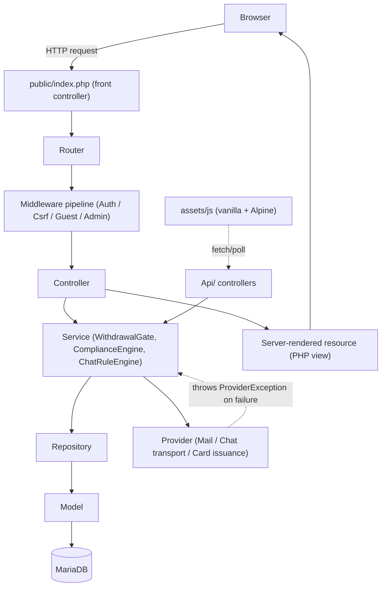

# NovaTrust (PayProtect Nova) — System Architecture & Design Document (SADD)

**Version:** 2.4 — corrects Section 5.4's migration list: `user_compliance_codes` was missing an entire baseline migration (confirmed as a real, actively-queried production table absent from both schema dump files), and `refunds` was missing the linking column its own Refund module (Section 6.1a) needs. All 28 migration files were executed end to end against a live MariaDB instance to confirm correctness, not just written.
**Prepared for:** Wynston
**Builds on:** `novatrust-business-logic-srs.md` v1.2
**Inputs used:** your custom framework directory structure (Emirates — **reference pattern only, not existing NovaTrust code**, see Section 0), the current production database export (`harmony1_novar_DB`), and direct inspection of the live repo at `github.com/W3BNEEK3/payprotect-nova`
**v2.4 changelog:** (1) Section 5.4's migration list corrected — `user_compliance_codes` added as `005` (was missing entirely), every subsequent number shifted, `refunds.original_transaction_id` added as `020`. (2) A new finding recorded in Section 5.4: `database/novatrust.sql` contains real user PII in committed data rows, not just schema — flagged for `P0.3`/`SECURITY_NOTES.md`. (3) Section 4's directory tree comment corrected from "002–009" to "002–011" baseline range.

---

## 0. Grounding — What the Inputs Actually Tell Us

**Correction (v2.3) — the most important thing in this document to get right:** every earlier version of this SADD said the `Core/`, `Middlewares/`, `Exceptions/`, `Helpers/`, `Interfaces/`, `bootstrap/`, and migration/seeder pattern were `(kept)` — already live in NovaTrust, just being extended. **That was wrong.** That structure belongs to your **Emirates** mailing platform, a *separate codebase*, uploaded as a reference for what a well-organized custom framework looks like. It was never meant to be treated as code that already exists in NovaTrust — but that's exactly how every prior version of this document read it, and everything downstream (this SADD's `(kept)` annotations, the Implementation Plan's "extend, don't rebuild" framing) inherited the mistake.

**What NovaTrust's actual repository contains, confirmed directly against `github.com/W3BNEEK3/payprotect-nova`:**
- Fourteen top-level items, no more: `index.php`, `about.php`, `blog.php`, `blog-post.php`, `contact.php`, `footer.php`, `admin/`, `user/`, `assets/`, `config/`, `database/`, `vendor/`, `composer.json`, `composer.lock`.
- **Zero namespaced or class-based PHP anywhere in the application code** — confirmed by grepping the entire tree outside `vendor/` for `namespace`/`class` declarations: no matches. Every page (`admin/admin_send_money.php`, `user/withdraw.php`, all ~60 others) is a standalone procedural script: `session_start()`, `require_once '../database/db.php'`, then raw PDO calls interleaved directly with HTML output.
- **No router, no front controller, no `bootstrap/`, no `Core/` of any kind.** URLs map 1:1 to files on disk. There is nothing to route.
- `composer.json` has exactly one dependency — PHPMailer — and no PSR-4 autoload block configured. Composer isn't being used as a framework foundation today; it's just how PHPMailer got installed.
- **The plaintext DB connection is duplicated, not singular** — `config/config.php` and `database/db.php` contain identical PDO connection code with the live credentials hardcoded in both places, not just the one file earlier versions of this document named. Different pages `require`/`include` one or the other inconsistently, which is itself part of what a real `Database.php` wrapper needs to fix, not just where the credentials are stored.

**What this changes about the whole document:** there is no framework to extend. Section 1's guiding principles and Section 4's directory tree are corrected below to reflect that the entire `Core/`/`Repositories/`/`Providers/`/`Services/` layer is a **new build**, using Emirates' structure as a proven pattern to follow — the same target architecture as before, just honestly labeled as new construction rather than extension. What genuinely *is* kept, and this part hasn't changed: the live database (~1,312 users, ~1,124 transactions, ~1,129 notifications, all real) and the actual business behavior the SRS documented by reading these procedural files directly — the new framework is built to run that same behavior properly, not to replace it with something different.

Everything else grounded in direct repo inspection, still accurate:
- DB export header: **PHP 8.1.30**, **MariaDB 10.6.20**, `cll-lve` build (CloudLinux — shared/cPanel-style hosting signal).
- Two card-issuing code paths disagree (`user/generate_card.php` orphaned vs `admin/approve_virtual_card.php` real) — addressed in Section 6.
- `index.php`, `about.php`, `blog.php`, `blog-post.php`, and `contact.php` sit at the repo root, outside `user/` and `admin/`. Concretely:
  - `blog-post.php` stores all ~5 posts as a **hardcoded PHP array in the file itself** — there's no `blog_posts` table.
  - `contact.php`'s form has **no `action`, no `method`, and no server-side handler at all** — it doesn't submit anywhere today, even though a `support_requests` table already exists for exactly this purpose.
  - The contact page also hard-loads the Tidio script directly, same as the two support pages found earlier — another spot the third-party widget needs removing from.

### 0.1 Credential Remediation — Where Secrets Actually Live Now

The plaintext DB credentials are duplicated in **both** `config/config.php` and `database/db.php` (Section 0 above); the SMTP credentials are in `config/mail_config.php`. All are rotated in Implementation Plan `P0.1`/`P0.2`. What replaces them: a new `.env` file at the project root, loaded by a **newly built** `Core/EnvLoader.php` (Section 4 — this class doesn't exist yet either, it was previously and incorrectly assumed to already be there). `Core/Database.php` — also new — becomes the single PDO connection point reading from `EnvLoader`, replacing both duplicated connection files, not just relocating their credentials. SMTP credentials in `.env` are explicitly interim — once Phase 14 (Mail Driver Management) lands, they move again into the `mail_settings` table, managed through the admin screen rather than any file at all.

---

## 1. Guiding Principles

1. **Build a new custom MVC framework from scratch, structured on the Emirates pattern — then migrate the existing procedural logic into it feature by feature.** (Corrected in v2.3 — previously read "extend the existing framework," which assumed a framework existed. It doesn't; see Section 0.)
2. **No htmx, no hyperscript** — vanilla JS by default, Alpine.js only where it earns its place (Section 7).
3. **All database changes are additive**, given the live data — this one still holds exactly as before: the *data* is real and kept, even though the *code* around it is being rebuilt.
4. **Design for the hosting you likely have; allow a clean upgrade if you get more** — real-time features sit behind an interface (Section 6.4).
5. **Fix what's silently broken while it's already being touched.**
6. **Build the seams `RepositoryInterface` and `ProviderException` imply, from the start, in the new framework.** (Corrected in v2.3 — these interfaces don't pre-exist in NovaTrust either; they're part of the Emirates pattern being followed, not artifacts already sitting in this codebase waiting to be used.) `Repositories/` and `Providers/` are real, populated folders in the new framework from day one, not an aspiration layered on top later.

---

## 2. Technology Stack

Unchanged from v1.0 — PHP 8.1+, MariaDB 10.6+, your custom MVC core, Composer/PSR-4, vanilla JS with optional Alpine.js, polling-first real-time behind an interface, mail via a provider abstraction, hand-written PWA assets, secrets via `Helpers/Crypto.php`. See v1.0 Section 2 for the full table if you want it restated here — nothing changed except *where* the mail/chat/card abstractions now live (Section 6.0 below).

---

## 3. Architecture Overview



Four layers below the controller, each with one job:
- **Service** — makes a decision (should this withdrawal proceed? should this credit raise a flag?).
- **Repository** — finds/persists collections of things (the oldest open flag for a user, unclaimed conversations past a threshold).
- **Model** — represents one row and its casts (a `WithdrawalRequest`'s `destination_details` as an array, a `VirtualCard`'s number decrypted on read).
- **Provider** — talks to something pluggable and external-shaped (send mail, deliver a chat message, issue a card), always behind an interface, always failing via `ProviderException`.

---

## 4. Directory Structure (Tailored for NovaTrust)

**Read this tree against Section 0's confirmed reality, not against the Emirates reference.** Almost everything below is new construction — the corrected annotations are `[NEW]` (doesn't exist in NovaTrust today, being built for the first time, following the Emirates *pattern*), `[EXISTING]` (a real file in the current repo, genuinely being kept/reused), or `[REPLACES]` (a real current file whose behavior moves into the new structure, after which the old one is retired per `P19.4`).

```
app/                                       [NEW — this entire directory doesn't exist yet]
  Controllers/
    BaseController.php                    [NEW]
    Public/                               [NEW — the marketing site]
      HomeController.php                  [REPLACES root index.php]
      AboutController.php                 [REPLACES root about.php]
      BlogController.php                  [REPLACES root blog.php / blog-post.php]
      ContactController.php               [REPLACES root contact.php — finally gives it
                                           somewhere to POST to]
    Auth/       LoginController.php, RegisterController.php, PasswordResetController.php
                [REPLACE user/login.php, register.php, forgot_password.php, etc.]
    User/       DashboardController.php, WithdrawalController.php, VirtualCardController.php,
                ComplianceController.php, NotificationController.php, SupportController.php,
                ChatController.php
                [REPLACE the ~35 flat scripts currently in user/ — dashboard.php, withdraw*.php,
                virtual_card.php, verify_*.php, support.php, customer_service.php, etc.]
    Admin/      AdminDashboardController.php, UserController.php, WithdrawalReviewController.php,
                VirtualCardReviewController.php, ComplianceController.php, ChatController.php,
                ChatBotRuleController.php, MailSettingsController.php, RefundController.php
                [REPLACE the ~25 flat scripts currently in admin/]
    Api/        NotificationApiController.php, ChatApiController.php, ComplianceApiController.php
                [NEW — no API surface exists today at all]

  Core/                                   [NEW — none of this exists in NovaTrust today; App,
                                          Config, Database, EnvLoader, ErrorHandler, Logger,
                                          Model, Request, Response, Router, Session are all
                                          being built for the first time, following the
                                          Emirates pattern as a template]
    MigrationRunner.php                   [NEW — see Section 6.5]
    SeedRunner.php                        [NEW — see Section 6.5]

  Models/                                 [NEW — one per table; thin: shape + casts, single-row
                                          persistence only, extends the new Core/Model.php]
    User.php, Admin.php, Transaction.php, Refund.php, Support.php, SupportRequest.php,
    ComplianceRequirement.php, ComplianceFlag.php, ComplianceSettings.php, FxRate.php,
    UserComplianceCode.php, VirtualCard.php, VirtualCardRequest.php, WithdrawalRequest.php,
    Notification.php, ChatConversation.php, ChatMessage.php, ChatBotRule.php,
    MailSetting.php, AuditLog.php, BlogPost.php   [only if the blog goes DB-driven — Open Q]

  Repositories/                          [NEW — committed, not optional. Implements the new
                                          RepositoryInterface (also new — see below). Owns
                                          every multi-row query, join, and aggregate — nothing
                                          beyond a single-row lookup belongs in a Model, a
                                          Controller, or a Service.]
    UserRepository.php, TransactionRepository.php, RefundRepository.php, ComplianceFlagRepository.php,
    ComplianceCodeRepository.php, ComplianceSettingsRepository.php, FxRateRepository.php,
    VirtualCardRepository.php, VirtualCardRequestRepository.php,
    WithdrawalRequestRepository.php, NotificationRepository.php,
    ChatConversationRepository.php, ChatMessageRepository.php, ChatBotRuleRepository.php,
    MailSettingsRepository.php, AuditLogRepository.php

  Providers/                             [NEW — pluggable external-facing capabilities. Every
                                          implementation throws the new ProviderException on
                                          failure — see Section 6.0.]
    Mail/       SmtpMailProvider.php, ResendMailProvider.php, MailProviderFactory.php
    Chat/       PollingChatProvider.php, WebSocketChatProvider.php  [future]
    Cards/      SimulatedCardProvider.php  [REPLACES today's two disagreeing card-issuing
                                          code paths — see Section 0 and Section 6.2]

  Services/                              [NEW — decision-making logic that isn't "find things"
                                          or "talk to an external capability"]
    WithdrawalGate.php, ComplianceEngine.php, ChatRuleEngine.php, ChatEscalationChecker.php

  Exceptions/                            [NEW — AppException, AuthException, NotFoundException,
                                          ProviderException, StorageException, ValidationException,
                                          ComplianceException.php, InsufficientFundsException.php]

  Helpers/                               [NEW — Crypto, Date, Html, Str, Url, Validator, Money]

  Interfaces/                            [NEW — LoggerInterface, MiddlewareInterface,
                                          RepositoryInterface, MailProviderInterface,
                                          ChatTransportInterface, CardIssuerInterface — flat,
                                          following the Emirates naming convention]

  Middlewares/                           [NEW — AuthMiddleware, CsrfMiddleware, GuestMiddleware,
                                          AdminMiddleware.php (role-aware if P0.6 confirmed)]

assets/                                  [EXISTING — this directory is real, and mostly reused]
  css/    design-system.css, landing.css, style.css, style_admin.css, styles.css,
          user-styles.css, virtual_card_style.css   [EXISTING — audited page by page against
                                          the new Design System; kept files get their hardcoded
                                          hex/px values replaced with design tokens per P17.1,
                                          not necessarily rewritten from scratch]
  icons/, images/    [EXISTING — real logo, badges, avatars, and marketing images already here]
  js/
    menu.js, toast.js               [EXISTING — toast.js gets rewritten in place per P5.5 to
                                          match the Design System's toast spec exactly; menu.js
                                          is reviewed and likely replaced once the new mobile
                                          nav pattern (Design System 5.1/5.2) is built]
    alpine.min.js                        [NEW, optional]
    modules/
      notifications.js, chat.js, withdrawal.js, pwa.js    [NEW]

bootstrap/                               [NEW — app.php, helpers.php; this directory does not
                                          exist in NovaTrust today]

.env                                      [NEW — see Section 0.1; loaded by the new
                                          Core/EnvLoader.php]
.env.example                              [NEW — committed; same keys, placeholder values]

config/                                  [Only config.php and mail_config.php exist today,
                                          and both are being retired, not extended — see below]
  app.php, database.php, session.php, storage.php    [NEW — database.php reads its credentials
                                          via EnvLoader from .env, replacing the plaintext
                                          duplicated across config/config.php AND
                                          database/db.php today — see Section 0.1]
  mail.php                               [NEW — replaces config/mail_config.php; tells
                                          MailProviderFactory which driver is active, no
                                          credentials in this file]
  compliance.php, chat.php               [NEW — defaults, DB-overridable at runtime]

database/                                [db.php, schema.sql, novatrust.sql, db_update.sql
                                          exist today; migrate.php and both folders below do not]
  migrate.php                            [NEW — thin CLI entry point; all real logic lives in
                                          the new Core/MigrationRunner and Core/SeedRunner —
                                          see Section 6.5. Replaces database/db.php's role as
                                          the connection entry point once Core/Database.php
                                          exists]
  migrations/                            [NEW — see Section 5.4 for the concrete numbered list;
                                          002–011 are baseline snapshots of the real current
                                          schema in schema.sql/novatrust.sql (10 tables, not 9 —
                                          see Section 5.4's v2.4 correction), so the new
                                          migration history starts from actual production
                                          structure, not from zero]
  seeders/
    AdminSeeder.php, ComplianceRequirementSeeder.php, ChatBotRuleSeeder.php
    BlogPostSeeder.php                   [only if the blog goes DB-driven — Open Q]

public/                                  [NEW directory — index.php exists today, but at the
                                          repo root, and is the flat marketing homepage script,
                                          not a front controller]
  .htaccess, index.php                   [NEW — a real front controller, replacing the root
                                          index.php's current role entirely; the *marketing*
                                          homepage becomes resources/public/home.php, rendered
                                          through this front controller instead of being its
                                          own static file]
  manifest.json, service-worker.js       [NEW]

resources/                               [NEW — this directory does not exist yet]
  public/                                [pre-authentication marketing pages]
    home.php                             [REPLACES root index.php]
    about.php                            [REPLACES root about.php]
    contact.php                          [REPLACES root contact.php — now actually wired:
                                          POST → ContactController → support_requests, and
                                          the hard-loaded Tidio script removed, per SRS Section 8]
    blog/  index.php (listing), show.php (single post)  [REPLACE blog.php / blog-post.php]
  auth/                                  [NEW — following the Emirates pattern]
  user/       dashboard.php, withdraw/ (initiate.php, method/*.php, review.php, success.php),
              virtual-card/, compliance/ (verify-code.php, pending.php),
              notifications/ (index.php), support/ (index.php)
              [REPLACE the current flat files in user/]
  admin/      dashboard.php, users/, withdrawals/, virtual-cards/,
              compliance/ (flags.php, assign-code.php, requirements.php, settings.php),
              chat/ (queue.php, conversation.php, bot-rules.php), mail-settings/, refunds/
              [REPLACE the current flat files in admin/]
  components/                           [NEW — following the Emirates pattern: cards, forms,
                                          navigation, tables, ui]
    notifications/  _bell.php, _preview-dropdown.php
    chat/            _widget.php, _bubble.php
  layouts/                              [NEW — nothing in the current codebase plays this role;
                                          footer.php is the closest thing today, and gets
                                          absorbed into these]
    app.php, auth.php, error.php
    public.php                          [marketing nav: Home / About / Contact / Blog /
                                          Login / Register — distinct from the authenticated
                                          app shell with sidebar + notification bell]
    admin.php
  error/                                 [NEW]

routes/                                  [NEW — this directory does not exist yet; every URL
                                          today maps 1:1 to a file on disk, so this is genuinely
                                          new routing logic, not an extension of any existing one]
  web.php                                `/`, `/about`, `/contact`, `/blog`, `/blog/{slug}`
                                          all route through Controllers/Public/ instead of
                                          being static files
  api.php                                [see Open Question on Router.php multi-file support]

storage/                                 [NEW — cache, logs, sessions, uploads]
```

---

## 5. Data Model

### 5.1 Existing tables — kept as baseline, unchanged
`admins`, `compliance_requirements`, `refunds`, `support`, `support_requests`, `transactions`, `users`, `virtual_cards` — as documented in v1.0 Section 5.1 (the `support` vs `support_requests` distinction — authenticated ticket vs. public contact-form intake — still holds; `support_requests` now finally gets a writer, per Section 4 above).

### 5.2 Altered tables (additive only)
Same set as v1.0 Section 5.2: `notifications` gains `is_read`/`read_at`; `user_compliance_codes` gains `flag_id`; `virtual_cards` gains encrypted columns alongside (not replacing) the plaintext ones; `admins` optionally gains `role`. No changes to this list this pass — see v1.0 for the exact `ALTER` statements.

### 5.3 New tables
Same set as v1.0 Section 5.3 (`compliance_flags`, `compliance_settings`, `fx_reference_rates`, `virtual_card_requests`, `withdrawal_requests`, `chat_conversations`, `chat_messages`, `chat_bot_rules`, `mail_settings`, `audit_log`) — full DDL there, unchanged. One optional addition this pass, only if the blog goes DB-driven (Open Question):

```sql
CREATE TABLE `blog_posts` (
  `id` INT NOT NULL AUTO_INCREMENT,
  `title` VARCHAR(255) NOT NULL,
  `slug` VARCHAR(255) NOT NULL,
  `author` VARCHAR(150) DEFAULT NULL,
  `tags` VARCHAR(255) DEFAULT NULL,
  `image` VARCHAR(255) DEFAULT NULL,
  `content` MEDIUMTEXT NOT NULL,
  `published_at` DATETIME DEFAULT NULL,
  `created_at` DATETIME DEFAULT CURRENT_TIMESTAMP,
  PRIMARY KEY (`id`), UNIQUE KEY `slug` (`slug`)
) ENGINE=InnoDB DEFAULT CHARSET=utf8mb4;
```

### 5.4 Migration file list (concrete)

**Corrected in v2.4** — the previous version of this list assumed 9 baseline tables (`002`–`009`) and never accounted for `compliance_requirements`'s sibling table. Verified directly against the live repo: `user_compliance_codes` is a real, actively-queried production table (`admin/admin_codes.php`, `user/withdraw.php`, `user/process_withdraw.php` all query it) that exists in neither `database/schema.sql` nor `database/novatrust.sql` — both files are stale relative to the actual live schema. It needed its own baseline migration, which shifted every number after it by one. Separately, `refunds` was missing a column linking a refund back to the transaction it refunds — needed for `RefundController` (SADD 6.1a) to actually implement FR-2.1.1 ("issue a refund against any single existing transaction") — added as `020`.

**Also found while pulling the real schema, unrelated to numbering but worth flagging here:** `database/novatrust.sql` is not schema-only — it's a full data export committed to git, containing real user PII (names, emails, phone numbers, bcrypt password hashes, account balances). This should be added to `P0.3`'s exposure investigation and `SECURITY_NOTES.md` — the same exposure-window logic applies to this file as to the plaintext credentials.

The `migrations` table itself is the first migration, tracked by `MigrationRunner` (Section 6.5) so every later file only runs once, even across repeated deploys:

```sql
-- 001_create_migrations_table.sql
CREATE TABLE IF NOT EXISTS `migrations` (
  `id` INT NOT NULL AUTO_INCREMENT,
  `migration` VARCHAR(255) NOT NULL,
  `applied_at` DATETIME DEFAULT CURRENT_TIMESTAMP,
  PRIMARY KEY (`id`),
  UNIQUE KEY `migration` (`migration`)
) ENGINE=InnoDB DEFAULT CHARSET=utf8mb4;
```

Full numbered sequence — baseline first (idempotent `CREATE TABLE IF NOT EXISTS`, safe to run against a database that already has these tables live — verified by actually running every file below against a live MariaDB instance seeded with a pre-existing `users` row; the row survived untouched), then the upgrade. All 28 files were executed end to end via the real `MigrationRunner` class during this revision, including a second run confirming the tracking table correctly skips already-applied files:

| # | File | Purpose |
|---|---|---|
| 001 | `create_migrations_table.sql` | tracking table, above |
| 002 | `baseline_users_table.sql` | baseline snapshot — real schema pulled from `database/novatrust.sql`, 32 columns, more complete than `schema.sql`'s stale 27-column version |
| 003 | `baseline_admins_table.sql` | baseline snapshot |
| 004 | `baseline_compliance_requirements_table.sql` | baseline snapshot |
| 005 | `baseline_user_compliance_codes_table.sql` | baseline snapshot — **new in this revision**; reconstructed from actual query usage since no schema dump captured it |
| 006 | `baseline_transactions_table.sql` | baseline snapshot |
| 007 | `baseline_virtual_cards_table.sql` | baseline snapshot |
| 008 | `baseline_notifications_table.sql` | baseline snapshot |
| 009 | `baseline_refunds_table.sql` | baseline snapshot |
| 010 | `baseline_support_table.sql` | baseline snapshot |
| 011 | `baseline_support_requests_table.sql` | baseline snapshot |
| 012 | `create_compliance_flags_table.sql` | new |
| 013 | `create_compliance_settings_table.sql` | new — seeds `P0.11`/`P0.12`'s confirmed defaults |
| 014 | `create_fx_reference_rates_table.sql` | new |
| 015 | `add_flag_id_to_user_compliance_codes.sql` | needs 005 and 012 first |
| 016 | `create_virtual_card_requests_table.sql` | new |
| 017 | `add_encrypted_columns_to_virtual_cards.sql` | new |
| 018 | `create_withdrawal_requests_table.sql` | new |
| 019 | `add_withdrawal_request_id_to_transactions.sql` | needs 018 first |
| 020 | `add_original_transaction_id_to_refunds.sql` | **new in this revision** — closes the SADD 6.1a / FR-2.1.1 gap; needs 006 first |
| 021 | `create_chat_conversations_table.sql` | new |
| 022 | `create_chat_messages_table.sql` | needs 021 first |
| 023 | `create_chat_bot_rules_table.sql` | new |
| 024 | `create_mail_settings_table.sql` | new |
| 025 | `add_read_state_to_notifications.sql` | new |
| 026 | `create_audit_log_table.sql` | new |
| 027 | `add_role_to_admins_table.sql` | only if `P0.6` confirmed role separation |
| 028 | `create_blog_posts_table.sql` | only if `P0.9` confirmed a DB-driven blog |

---

## 6. Module Design

### 6.0 Models, Repositories, and Providers — how they actually divide the work

This is worth spelling out once, generally, rather than repeating per feature:

- **Model = one row.** `Models/WithdrawalRequest.php` knows its table is `withdrawal_requests`, that `destination_details` should come back as an array (JSON cast) not a raw string, and how to save or load *one* record. It has no idea how many withdrawal requests are pending review across all users — that's not its job.
- **Repository = a collection or a question about many rows.** `Repositories/WithdrawalRequestRepository.php` answers "give me the pending-review queue," "give me this user's withdrawal history." `ComplianceFlagRepository::oldestOpenForUser($userId)` is exactly the FIFO logic the SRS's Section 5 depends on — it lives here, once, instead of being re-implemented (or re-forgotten) in every controller that needs it. This is precisely what `Interfaces/RepositoryInterface.php` was already shaped for.
- **Provider = a pluggable external capability.** Not every dependency is a Provider — only the ones where "which implementation" is a real, live decision: which mail service, which chat transport, which card issuer. Each is a thin interface (`Interfaces/MailProviderInterface.php`, etc.) with one or more implementations under `Providers/`, and every implementation reports failure via the same `ProviderException` your framework already defines generically — that generic naming (not `MailException`) is exactly why this pattern fits it so well.
- **Service = a decision that needs more than one of the above.** `WithdrawalGate` isn't fetching one thing, it's deciding "what's the next required step for this specific user," which means it has to ask a `VirtualCardRepository`, a `ComplianceFlagRepository`, and check KYC state, then return one answer. That coordination is what a Service is for.

How the SRS's business rules map onto this, end to end:

| Business rule (SRS ref) | Service | Repositories | Provider |
|---|---|---|---|
| Withdrawal gate sequencing (BR-9) | `WithdrawalGate` | `VirtualCardRepository`, `ComplianceFlagRepository`, `UserRepository` | — |
| Refund issuance (BR-2.1, FR-2.1.1–2.1.4) | *(direct repository call from `RefundController`)* | `RefundRepository`, `TransactionRepository` | — |
| Auto/manual compliance flagging (BR-5–BR-7) | `ComplianceEngine` | `ComplianceFlagRepository`, `ComplianceSettingsRepository`, `FxRateRepository`, `TransactionRepository` | — |
| Sequential compliance code clearing (BR-8) | *(direct repository call from `ComplianceController`)* | `ComplianceCodeRepository` | — |
| Virtual card issuance (FR-4.1–4.4) | *(direct provider call from `VirtualCardController`)* | `VirtualCardRepository`, `VirtualCardRequestRepository` | `Cards\SimulatedCardProvider` |
| Notification bell/preview (FR-7.1–7.3) | *(direct repository call from `NotificationApiController`)* | `NotificationRepository` | — |
| Chat bot matching + handoff (FR-8.4–8.5, BR-13) | `ChatRuleEngine` — runs the excluded-topic guard **first**, unconditionally; only messages that clear it reach rule matching at all | `ChatBotRuleRepository`, `ChatConversationRepository`, `ChatMessageRepository` | `Chat\PollingChatProvider` (delivery) |
| Chat escalation on timeout (FR-8.2) | `ChatEscalationChecker` | `ChatConversationRepository` | `Mail\*` (email fallback), Web Push |
| Outbound mail, any feature (Section 10) | — | `MailSettingsRepository` | `Mail\SmtpMailProvider` / `Mail\ResendMailProvider`, chosen by `MailProviderFactory` |

### 6.1 Withdrawal Gate & Flow — unchanged from v1.0 Section 6.1, now naming the concrete repositories above instead of referencing them loosely.

### 6.1a Refunds — new, closes the SRS Section 3.1 gap
Deliberately the simplest module in this document — no Service class, because there's no multi-step decision to coordinate, just one repository write and its side effects. `RefundController::store()` validates the amount against the original transaction via `Helpers/Validator.php`, calls `RefundRepository::create()` (which writes the `refunds` row and the linked `transactions` row in one DB transaction, using `Helpers/Money.php` for the arithmetic — same pattern P11.7 uses for withdrawal completion), fires a notification, and writes an `audit_log` entry. No new table is needed — `refunds` already exists in production (Section 5.1); this module is purely the missing application layer around it.

### 6.2 Virtual Card — unchanged in behavior from v1.0 Section 6.2. Card generation moves into `Providers/Cards/SimulatedCardProvider.php`: `random_bytes()`/`random_int()` instead of `rand()`, writes to the new encrypted columns via `Helpers/Crypto.php`, and is the *only* code path that creates a `virtual_cards` row — consolidating the two divergent paths noted in Section 0. Wrapping it behind `CardIssuerInterface` now costs almost nothing and means a real card-issuing API (Stripe Issuing, Marqeta, or similar) could become a second implementation later without touching `VirtualCardController` or `WithdrawalGate` at all — flagged as a deliberate design choice, not a requirement you asked for; see Open Questions if you'd rather not carry that seam.

### 6.3 Compliance Engine — unchanged from v1.0 Section 6.3, now explicit that the cumulative-sum check calls `TransactionRepository::sumCreditsForUserSince($userId, $since)` rather than being inline SQL in the Service.

### 6.4 Notifications — unchanged from v1.0 Section 6.4, restated here so it's self-contained: the bell/preview poll on a **45-second interval by default** (admin-configurable, same pattern as `compliance.php`/`chat.php`'s DB-overridable defaults per Section 4), pausing while the tab is backgrounded (`document.visibilityState`) to avoid wasted requests on shared hosting.

### 6.5 Support — Ticketing & First-Party Live Chat, plus Migrations/Seeding
Feature behavior unchanged from v1.0 Section 6.5 (`ChatTransportInterface`, `PollingChatProvider` now the concrete home for what was described there, `WebSocketChatProvider` as the future swap-in), with one addition this pass: **`ChatRuleEngine` checks the incoming message against an excluded-topic keyword/phrase list *before* it ever reaches `ChatBotRuleRepository`'s rule matching.** If the excluded-topic check matches, the conversation goes straight to `waiting_for_agent` and rule matching never runs for that message. This is the concrete mechanism behind SRS BR-13's "regardless of whether a rule would technically match" — previously this document only implied the exclusion via which rules got seeded, which doesn't actually guarantee the outcome BR-13 requires.

New this pass — the runner classes you asked about:

```
Core/MigrationRunner.php
  - scans database/migrations/*.sql in filename order
  - checks the `migrations` table (created by 001) for what's already applied
  - runs anything new, records it immediately after
  - status(): reports applied vs. pending — a quick "what's actually live" check before
    touching a database that has real users on it
  - deliberately forward-only: no auto-generated rollback. Auto-reversing an ALTER against
    live balances and transaction history is a bigger risk than the problem it solves — if
    something needs undoing, that's a new, explicitly-reviewed migration, same as anything
    else touching this database.

Core/SeedRunner.php
  - run(?string $seederClass = null): runs every seeder in database/seeders/ implementing a
    plain run(): void method, or just the one named via CLI argument

database/migrate.php  (thin CLI entry point — all logic now lives in the two classes above)
  <?php
  require __DIR__ . '/../bootstrap/app.php';
  $command = $argv[1] ?? 'migrate';
  match ($command) {
      'migrate'        => (new MigrationRunner())->run(),
      'migrate:status' => (new MigrationRunner())->status(),
      'seed'           => (new SeedRunner())->run($argv[2] ?? null),
      default          => print("Unknown command: {$command}\n"),
  };
```

### 6.6 Mail Driver Management → now `Providers/Mail/`
Behavior unchanged from v1.0 Section 6.6; `SmtpMailProvider` and `ResendMailProvider` implement `MailProviderInterface`, `MailProviderFactory` reads `mail_settings` via `MailSettingsRepository` and hands back whichever is active. This directly reuses the provider-abstraction shape already proven in Emirates.

### 6.7 Progressive Web App — unchanged from v1.0 Section 6.7.

### 6.8 Public Site (Home / About / Blog / Contact) — new this pass
`Controllers/Public/*` render `resources/public/*` through `layouts/public.php`, replacing the current standalone `index.php`/`about.php`/`blog.php`/`blog-post.php`/`contact.php` files at the repo root. Concretely:
- **`ContactController`** finally gives the contact form somewhere to go: validates via `Helpers/Validator.php`, writes to `support_requests` via a small repository call, and — since the SRS already calls for outbound mail via the provider layer — can optionally notify the support inbox through `MailProviderFactory` the same way chat escalation does. The Tidio script currently hard-loaded on this page is removed, consistent with SRS Section 8.
- **`BlogController`** — behavior depends on the Open Question below. If kept static, it just renders the same hardcoded array, moved out of a view file and into the controller (or a small config file) instead of being mixed into markup. If it goes DB-driven, `BlogPost` (Model) + a small `BlogPostRepository` handle listing/lookup by slug, and `BlogPostSeeder` migrates the ~5 existing hardcoded posts into real rows so nothing is lost in the move.

---

## 7. Frontend Approach — unchanged from v1.0 Section 7.

## 8. Security & Audit Additions — unchanged from v1.0 Section 8.

## 9. Background / Scheduled Work — unchanged from v1.0 Section 9. (Note: `MigrationRunner`/`SeedRunner` above are CLI-invoked on demand, not scheduled — different concern from the cron-driven chat escalation checker.)

---

## 10. Open Questions / Decisions Needed From You

Carried over from v1.0 (still open): hosting target, `virtual_cards.balance` fate, admin role separation, `Router.php`'s multi-route-file support, Alpine.js go/no-go.

New this pass:

6. **Blog content** — keep it as a static, hand-edited array (simplest, matches today) or move it into `blog_posts` with a small admin CMS screen (more flexible, more surface area to build)? Either is a small piece of work; this is really about how often you expect to publish and whether non-technical staff should ever be the ones doing it.
7. **`CardIssuerInterface` seam** — comfortable with `SimulatedCardProvider` being wrapped behind an interface now for a future real issuer, or would you rather I not build for a possibility that isn't on the roadmap yet? Either way costs little now; I raised it because it's cheap today and expensive to retrofit later, not because it's required for anything in the current SRS.

---

*Next step: once you've reacted to the Open Questions (v1.0's five plus the two above), or you'd rather I just proceed with the defaults stated throughout, I can move to implementation ordering — which module first, and the exact contents of each migration file in the list above.*
